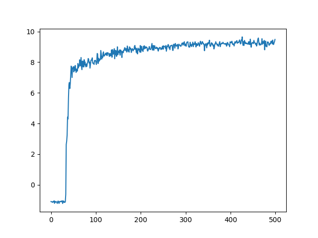

# TicTacTorch
### Simple and fun way to train an optimal policy in pytorch for the game of tic-tac-toe using deep reinforcement learning.

## Usage
Just run ````python train.py````. Training file has ~100 lines of code.

## Dependencies
```
torch, matplotlib

# also see requirements.txt, most dependencies because of jupyter
# Project was implemented using python 3.9
```

## Results


After only 500 epochs the policy yields pretty good results. Avg rewards are evaluated playing vs random
opponent. Winning reward is 10.0.

The model does not play fully optimal (yet). While it knows the obvios moves it does not know the infamous fork (example 2).
I think with enough training and probably a better way of collecting samples and better hyperparameters a fully optimal policy can be achieved. 
See some examples below.

### Example 1: Policy is pretty confident to take the win.
```
|X|X|_|      
|O|O|_|      
|_|_|_|      

2.5686e-09, 1.5244e-08, -->9.9981e-01<--, 2.7497e-11, 1.7390e-10, 1.8577e-04, 2.9413e-07, 7.8447e-10, 9.5791e-07
```

### Example 2: Policy does consider right move however thinks move 7 is better instead of blocking strategic win for X.
```
|X|_|X|      
|_|_|_|      
|O|_|_|      

1.0027e-08, 7.6977e-02, 3.0214e-10, 1.3873e-04, 2.0368e-04, 9.7937e-06, 4.6884e-08, -->6.8770e-01<--, 2.3497e-01
```

### Example 3: Policy clearly prefers edges and middle field as starting move.
```
|_|_|_|      
|_|_|_|      
|_|_|_|      

1.7106e-01, 7.0867e-12, 1.7036e-01, 4.5642e-07, 3.2582e-01, 3.6975e-08, 1.6422e-01, 2.3134e-12, 1.6854e-01
```

## Environment
The game environment is fully written in pytorch. Thought it was good for practicing working with tensors.

## Model Architecture
I think it does not really matter in such a simple case. The model uses a Conv2d since it takes a 3x3 board
as input. The output is a probability distribution (our policy) of shape (9). Each element represents 
an action which is a position on the board.
```
# number of parameters: 4569
nn.Conv2d(...)
nn.ReLU()
nn.LayerNorm(...)
nn.Linear(...)
nn.Softmax(...)
```

## Algorithm
For gathering training data the algorithm just uses a shitton of Monte Carlo rollouts.
This could be very much improved using parallel processing however I wanted to keep the code as simple
as possible. Basically each iteration the algorithm takes a random step, then simulates many rollouts to
get the target probability distribution for taking the best actions. This is repeated and after each step
the states and target probabilities are sotred in a replay buffer. After collecting enough samples the model
is trained using cross entropy loss of predicted probabilities and target probabilities to get to the optimal
policy over time.

NOTE: The model takes game state as input however it sees tha state always as player 1. So when saving 
the samples into the buffer if it is player 2 turn the state is flipped. This has to be considered when testing
the policy also.

Also training is done in CPU only, since there's no need for GPU at this scale.

## Todos
- [ ] Add parallel processing for rollouts
- [ ] Use greedy policy for exploration instead of fully random
